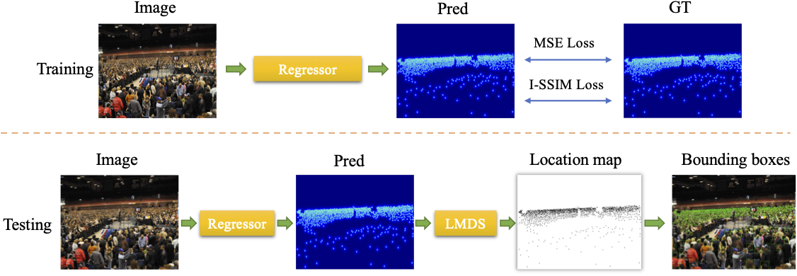
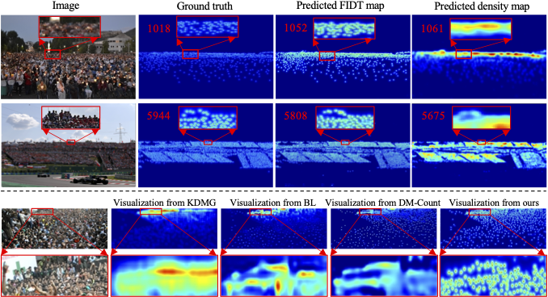

# Focal Inverse Distance Transform Map
* An officical implementation of Focal Inverse Distance Transform Map. We propose a novel map named Focal Inverse Distance Transform (FIDT) map,  which can represent each head location information.

* Paper [Link](https://arxiv.org/abs/2102.07925)
## Overview


# Visualizations



# Progress
- [x] Testing Code (2021.3.16)
- [x] Pretrained model
  - [x] ShanghaiA  (2021.3.16)
  - [x] ShanghaiB  (2021.3.16)
- Bounding boxes visualizations(2021.3.24)

# Environment

	python >=3.6 
	pytorch >=1.4
	opencv-python >=4.0
	scipy >=1.4.0
	h5py >=2.10
	pillow >=7.0.0
	imageio >=1.18
	nni >=2.0 (python3 -m pip install --upgrade nni)

# Datasets

- Download ShanghaiTech dataset from [Baidu-Disk](https://pan.baidu.com/s/15WJ-Mm_B_2lY90uBZbsLwA), passward:cjnx; or [Google-Drive](https://drive.google.com/file/d/1CkYppr_IqR1s6wi53l2gKoGqm7LkJ-Lc/view?usp=sharing)
- Download UCF-QNRF dataset from [here](https://www.crcv.ucf.edu/data/ucf-qnrf/)
- Download JHU-CROWD ++ dataset from [here](http://www.crowd-counting.com/)
- Download NWPU-CROWD dataset from [Baidu-Disk](https://pan.baidu.com/s/1VhFlS5row-ATReskMn5xTw), passward:3awa; or [Google-Drive](https://drive.google.com/file/d/1drjYZW7hp6bQI39u7ffPYwt4Kno9cLu8/view?usp=sharing)

# Generate FIDT Ground-Truth

```
cd data
run  python fidt_generate_xx.py
```

“xx” means the dataset name, including sh, jhu, qnrf, and nwpu. You should change the dataset path.

# Model

Download the pretrained model from [Baidu-Disk](https://pan.baidu.com/s/1SaPppYrkqdWeHueNlcvUJw), passward:gqqm or [Google-Drive](https://drive.google.com/drive/folders/1c-99hZaVaqIb7UV_8G0Dz4psuNncO5en?usp=sharing)

# Quickly test

```
git clone https://github.com/dk-liang/FIDTM.git
```

Download Dataset and Model

Generate FIDT map ground-truth
	
```
run python make_npydata.py
```

Test example:
```
python test.py --test_dataset ShanghaiA --pre ./model/ShanghaiA/model_best.pth --gpu_id 0
python test.py --test_dataset ShanghaiB --pre ./model/ShanghaiB/model_best.pth --gpu_id 0
```
If you want to generate bounding boxes,
```
python test.py --test_dataset ShanghaiA --pre model_best.pth  --visual True
(remember to change the dataset path in test.py)
```


More config information is provided in config.py
# Evaluation localization performance
```
cd ./local_eval
```
Generate coordinates of Ground truth. (Remember to change the dataset path)
```
python A_gt_generate.py 
python eval.py
```
We choose two thresholds (4, 8) for evaluation. The evaluation code is from [NWPU](https://github.com/gjy3035/NWPU-Crowd-Sample-Code)


# Training

The official training code is coming soon. 
Also, the training strategy is very simple. You can replace the density map with the FIDT map in any regressors for training.


